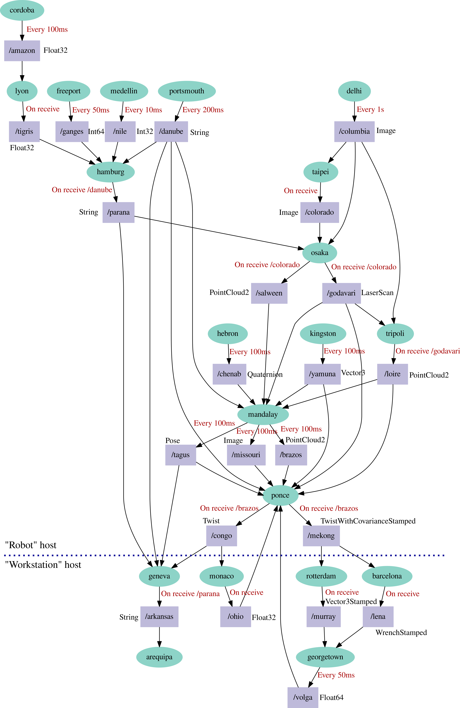

# Montblanc

The purpose of this example is to demonstrate how Zenoh-Flow can handle a
complex dataflow graph, like a robotic application.

## Graph
.


## How to run

### Build (for Rust nodes only)

We first generate the different shared libraries of the different nodes.

```shell
cd ~/dev/zenoh-flow-examples/montblanc && cargo build --workspace --release
```

### Update the paths

For each YAML file in the list below, check that the paths and filenames are
correct:
- montblanc.yml
- arequipa/arequipa.yml
- barcelona/barcelona.yml
- cordoba/cordoba.yml
- delhi/delhi.yml
- freeport/freeport.yml
- geneva/geneva.yml
- georgetown/georgetown.yml
- hamburg/hamburg.yml
- hebron/hebron.yml
- kingston/kingston.yml
- lyon/lyon.yml
- madelin/madelin.yml
- mandalay/mandalay.yml
- monaco/monaco.yml
- osaka/osaka.yml
- ponce/ponce.yml
- portsmouth/portsmouth.yml
- rotterdam/rotterdam.yml
- taipei/taipei.yml
- tripoli/tripoli.yml

### Launch

#### 1st terminal: Zenoh

```shell
cd ~/dev/zenoh && ./target/debug/zenohd -c ~/.config/zenoh-flow/zenoh.json
```

#### 2nd terminal: Zenoh-Flow daemon

```shell
cd ~/dev/zenoh-flow/ && ./target/debug/zenoh-flow-daemon -c ~/.config/zenoh-flow/runtime.yaml
```

#### 3rd terminal: launch the flow

```shell
cd ~/dev/zenoh-flow && ./target/debug/zfctl launch ~/dev/montblanc/montblanc.yml
```

Then, if the flow was successfully launched, you can see its output
with the command

```shell
tail -f "/tmp/montblanc.out"
```
